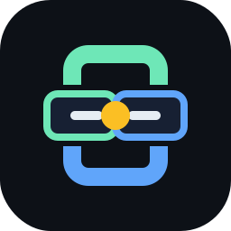

<p align="center">
  
</p>

# Provider Config Sync

**One control plane for AI-agent configuration across Claude, Codex, and Gemini.**

Provider Config Sync keeps each provider's native config files intact while giving teams a unified way to compare, edit, and apply equivalent capabilities across providers: instructions, memory, MCP servers, skills, commands, and custom agent definitions.

It is built for the messy reality of multi-provider agent workflows: every CLI has its own file layout, config syntax, and extension points. Provider Config Sync abstracts those differences without hiding them, so you can standardize what should be shared and preserve provider-specific power where it matters.

## Why It Exists

AI coding agents are becoming operating environments, and their config files are no longer minor setup details. They shape token usage, tool access, context quality, answer correctness, agent effectiveness, and how much wall-clock time gets spent on every task. A small stale instruction, missing MCP server, or mismatched project memory can quietly make an agent slower, more expensive, less reliable, or just wrong.

That makes these files worth editing deliberately, even manually. Teams now carry important behavior in files like:

- `CLAUDE.md`
- `AGENTS.md`
- `GEMINI.md`
- `.mcp.json`
- provider settings files
- skills and custom subagent definitions
- project memory files

The problem: those files represent the same capabilities in different formats.

Provider Config Sync gives those capabilities names, tracks a unified version, and shows each provider-specific version side by side so changes can move in either direction.

## What You Get

- **Unified capabilities, native files**
  Keep Claude, Codex, and Gemini using their own real config files. Provider Config Sync never replaces the provider-native configuration system.

- **Bidirectional sync**
  Apply changes from unified to provider-specific files, or pull provider-specific changes back into unified tracking.

- **Structured normalization**
  MCP servers, skills, and custom agents are converted into a common editable shape, then written back in each provider's native format.

- **Provider extensions stay visible**
  Common fields can be managed consistently, while provider-only metadata remains editable instead of being discarded.

- **Token visibility**
  Estimate config tokens per provider file, per unified capability, and across the whole project so config cost is visible.

- **Standalone backend**
  Run the sync engine as a standalone FastAPI service without Better Claude.

- **Agent extension**
  Expose the same sync engine as an MCP server for Goose and other MCP-capable agents.

- **Reusable frontend core**
  Use the TypeScript diff/item helpers in your own UI.

- **Capability picker**
  Embed a host-neutral picker that lists every known global and project capability, converts the selected capability into all configured provider forms, and lets another app use all outputs or one provider-specific output.

- **Safer writes**
  Writes use expected-content checks, atomic creation, and first-write backups to avoid silent clobbering.

## Supported Capabilities

| Capability | Claude | Codex | Gemini |
| --- | --- | --- | --- |
| General instructions | `CLAUDE.md` | `AGENTS.md` | `GEMINI.md` or configured context file |
| Project memory | Claude project memory | unified capability tracking | unified capability tracking |
| MCP servers | `.mcp.json` / settings | `config.toml` | `settings.json` |
| Skills | `.claude/skills` | `.agents/skills` | `.agents/skills` / `.gemini/skills` |
| Commands / skills | `.claude/commands/*.md` | `.agents/skills/command-*/SKILL.md` | `.gemini/commands/*.toml` |
| Custom agents | Markdown frontmatter | TOML | Markdown frontmatter |
| Provider settings | JSON/settings | TOML | JSON/settings |

## Repository Layout

```text
packages/
  provider-config-sync-backend/
    src/provider_config_sync_backend/
      api.py          # discovery, conversion, apply/write API
      standalone.py   # standalone FastAPI app + CLI entrypoint

  provider-config-sync-core/
    src/
      diff.ts         # aligned diff rows, hunks, line/block apply helpers
      items.ts        # normalized item parsing helpers
```

## Quick Start

Install the standalone package:

```bash
pipx install "better-agent-provider-config-sync-backend[all] @ git+https://github.com/ofekron/provider-config-sync.git#subdirectory=packages/provider-config-sync-backend"
```

Or clone and install locally:

```bash
git clone https://github.com/ofekron/provider-config-sync.git
cd provider-config-sync

python -m venv .venv
. .venv/bin/activate
pip install -e "packages/provider-config-sync-backend[server]"
```

Create a config file:

```json
{
  "sync_home": "~/.provider-config-sync",
  "providers": [
    { "id": "claude", "name": "Claude", "kind": "claude", "config_dir": "~/.claude" },
    { "id": "codex", "name": "Codex", "kind": "codex", "config_dir": "~/.codex" },
    { "id": "gemini", "name": "Gemini", "kind": "gemini", "config_dir": "~/.gemini" }
  ],
  "projects": [
    { "path": "/absolute/path/to/your/project", "node_id": "primary" }
  ]
}
```

Run the API:

```bash
PROVIDER_CONFIG_SYNC_CONFIG=./provider-config-sync.json provider-config-sync-backend
```

Open:

```text
http://127.0.0.1:8765/api/provider-config-sync?cwd=/absolute/path/to/your/project
```

Verify the standalone package:

```bash
python tests/test_standalone_package.py
```

## Use With Agents

Goose can install custom MCP servers as extensions. Add Provider Config Sync as a stdio extension:

```text
Name: Provider Config Sync
Command: provider-config-sync-mcp
Environment:
  PROVIDER_CONFIG_SYNC_CONFIG=/absolute/path/to/provider-config-sync.json
```

Then ask Goose to inspect or sync agent config capabilities for the current project. The MCP server exposes tools to list capabilities, read files, edit files with conflict checks, apply unified-to-specific changes, pull provider-specific changes into unified tracking, and manage structured items such as MCP servers, skills, commands, and agents.

To open the inline Goose UI, ask Goose to run:

```text
open_provider_config_sync_gui
```

The Goose app renders from the same stdio MCP server with a `ui://provider-config-sync/main` MCP App resource. It lets users load a project, inspect token totals, edit provider or unified files, and apply a selected file to the matching unified/provider side without leaving Goose.

For a local checkout, use:

```text
Command: /absolute/path/to/provider-config-sync/.venv/bin/provider-config-sync-mcp
Environment:
  PROVIDER_CONFIG_SYNC_CONFIG=/absolute/path/to/provider-config-sync/provider-config-sync.json
```

Install native commands/skills into the providers themselves:

```bash
provider-config-sync-install-agent-integrations
```

That installs:

```text
~/.claude/commands/provider-config-sync.md
~/.agents/skills/provider-config-sync/SKILL.md
~/.gemini/commands/provider-config-sync.toml
```

Those commands/skills tell Claude Code, Codex, and Gemini to use the unified capability form first, then apply the capability to the other configured providers.

Run automatic reconciliation through your preferred CLI:

```bash
PROVIDER_CONFIG_SYNC_CONFIG=./provider-config-sync.json \
  provider-config-sync-automate --cli claude --prompt "Reconcile everything conservatively."
```

Supported `--cli` values are `claude`, `codex`, and `gemini`. The command runs the selected agent in non-interactive mode with the Provider Config Sync MCP server attached for that run, then asks it to reconcile global config plus every project listed in `provider-config-sync.json`.

## API Surface

The standalone app mounts:

```text
GET    /api/provider-config-sync
GET    /api/provider-config-sync/capability-picker
PUT    /api/provider-config-sync/file
POST   /api/provider-config-sync/apply
POST   /api/provider-config-sync/unified-capability-item
DELETE /api/provider-config-sync/unified-capability-item
```

Use `GET /api/provider-config-sync?cwd=...` to discover capabilities and file entries. The response includes unified entries and provider-specific entries with `entry_id`, content, existence, writability, estimated token counts, diff status, and provider metadata.

Use `GET /api/provider-config-sync/capability-picker?cwd=...` when a host needs to choose a capability from anywhere Provider Config Sync knows about. The response flattens global capabilities plus every configured primary project capability into picker sources, each with the original capability payload, a preferred readable entry, and converted outputs for every configured provider-specific form. The endpoint is deliberately host-neutral: it does not know about any one application runtime. A host can render the picker, receive all provider outputs or one selected provider output, and decide how that selection applies to its own objects.

## MCP Tools

```text
list_provider_config_capabilities
read_provider_config_entry
write_provider_config_entry
apply_provider_config_entry
upsert_unified_capability_item
remove_unified_capability_item
```

Agents should list capabilities first, read the relevant entries, then pass the latest `expected_content` / `expected_source` / `expected_target` when writing or applying changes.

## Library Usage

Backend:

```python
from pathlib import Path
from provider_config_sync_backend.api import configure, router

configure(
    provider_records=lambda: [
        {"id": "claude", "name": "Claude", "kind": "claude", "config_dir": "~/.claude"},
        {"id": "codex", "name": "Codex", "kind": "codex", "config_dir": "~/.codex"},
    ],
    project_records=lambda: [{"path": "/repo", "node_id": "primary"}],
    sync_home=lambda: Path("~/.provider-config-sync").expanduser(),
)
```

Frontend:

```ts
import { buildAlignedDiffRows } from "@better-agent/provider-config-sync-core/diff";
import { parseMcpServers } from "@better-agent/provider-config-sync-core/items";
import { ProviderCapabilityPicker } from "@better-agent/provider-config-sync-ui";
```

## Design Principles

- **Native first**: providers keep reading their own files.
- **Unified is a tracking layer**: it helps compare and propagate equivalent capabilities; it is not a runtime replacement for provider config.
- **Picker is host-neutral**: Provider Config Sync can enumerate and render capability choices, but the embedding host owns what a selected capability means in its own workflow.
- **No silent overwrites**: writes require the expected previous content.
- **Format abstraction, not format erasure**: common fields get a common UI shape, provider-specific metadata survives round trips.
- **Portable core**: the backend package has no Better Claude dependency.

## License

MIT
